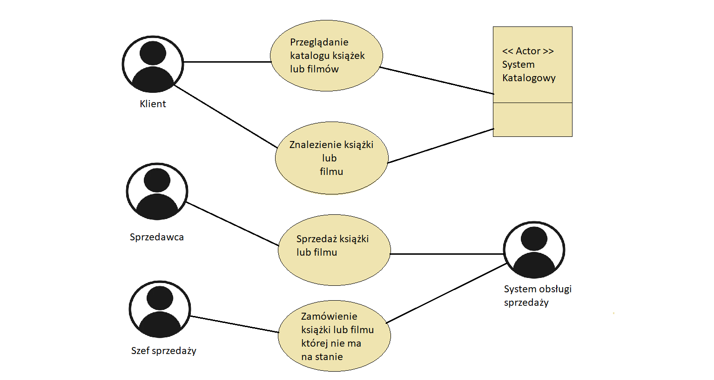
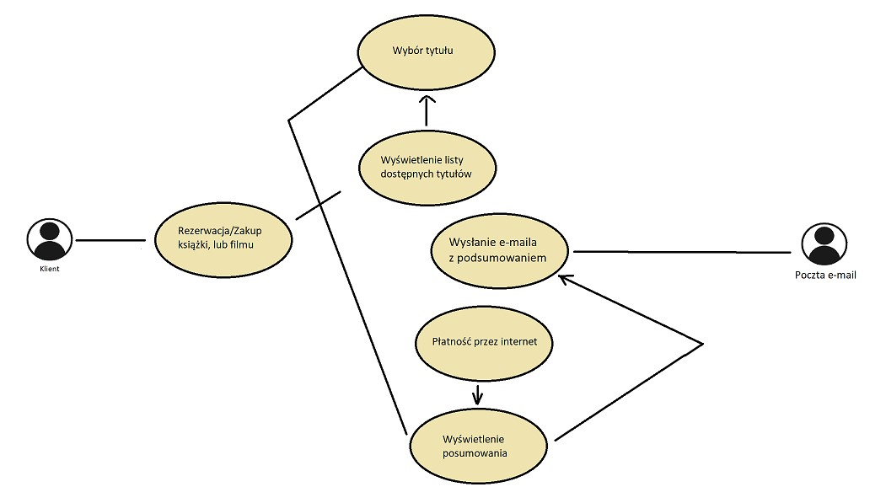

# Wypożyczalnia ksiązek i filmów
## Spis treści
1. Wprowadzenie
    * Cel
    * Zakres
    * Definicje
2. Opis ogólny
    * Diagramy przypadków użycia
    * Scenariusz przypadków użycia
    * Założenia i zależności
3. Wymagania systemowe
    * Wymagania funkcjonalne
    * Wymagania niefunkcjonalne

## 1.Wprowadzenie
Dokument ten został stworzony na potrzeby projektu z Inżynierii OprogramowaniaSystem. Prezentuje  wynik fazy analizy i przedstawia specyfikacje wymagań.
### Cel
Dokument ten ma za zadanie przedstawienie wymagań na stronę internetową w formie zwięzłej, sformalizowanej i dla każdego przystępnej.
### Zakres
Dokument ten obejmuje czynniki, których wymagamy od sporządzanego systemu. Czynniki te obejmują zaplanowane platformy, liczbę
użytkowników, które muszą być obsługiwane oraz wszystko to, co ogranicza projekt.
### Definicje
## 2.Opis ogólny
Celem projektu jest utworzenie wypożyczalni książek i filmów w której klienci za uiszczeniem opłaty będą mogli wypożyczyć książki lub filmy na określony okres 
czasu lub wykupić na stałe. Serwis będzie posiadać system kont dla użytkowników co pozwoli im na śledzenie ilości wypożyczonych książek i filmów
oraz na otrzymywanie spersonalizowanych propozycji i promocji. Użytkownicy będą mieli również możliwość przedłużenia czasu wypożyczenia przy dodatkowej
opłacie. Dostępne będzie również wykupienie abonamentu pozwalającego np. na wypożyczanie bez obowiązku płacenia za każdym wypożyczeniem.
Dodatkowo każdy użytkownik będzie mógł stworzyć grupę swoich znajomych i porównywać się z nimi w ilości przeczytanych książek, lub obejrzanych
filmów w formie rywalizacji. Na stronie zostanie umieszczony ranking przeczytanych książek oraz obejrzanych filmów wraz z ilością zamieszczonych recenzji.
Platforma umożliwi przeglądanie profilu użytkownika, przeczytane książki oraz umieszczone komentarze. Administratorzy będą mieli również możliwość aktualizowania bazy 
filmów i książek o nowe pozycje.
### Diagramy przypadków użycia

### Scenariusz przypadków użycia
#### Główny scenariusz:
1. Użytkownik chce wypożyczyć film bądź książkę. 
2. Użytkownik rejestruje się na stronie wypożyczalni. 
3. Użytkownik wybiera interesujący go film bądź książkę. 
4. Użytkownik wykupuje możliwość wypożyczenia danego filmu bądź książki poprzez przelew. 
5. Użytkownik otrzymuje wiadomość e-mail, z kodem odblokowującym możliwość wypożyczenia danego filmu bądź książki na czas określony. 
6. Użytkownik po wpisaniu kodu na stronie wypożyczalni, odblokowuje możliwość wypożyczenia danego filmu bądź książki na czas określony. 
7. Użytkownik wypożycza dany film bądź książkę na czas określony. 
#### Rozszerzenia:
2. Użytkownik nie może zarejestrować się na stronę.
* Strona sprawdza, czy dane podane przez użytkownika nie znajdują się już w bazie danych strony. Jeśli dane znajdują się już w bazie danych strony, strona wyświetla komunikat informujący użytkownika o zaistniałej sytuacji.
4. Karta lub przelew został odrzucony.
* Strona sprawdza, czy dane karty podane przez użytkownika, są poprawne. Jeżeli nie, użytkownik strona wyświetla komunikat informujący użytkownika o błędzie.
* Strona wyświetla komunikat z prośbą o sprawdzenie przez użytkownika, aby ten sprawdzić, czy środki na koncie są wystarczające do wypożyczenia filmu bądź książki.
* Strona wyświetla komunikat z prośbą o sprawdzenie przez użytkownika czy limit kwoty przelewu jest wyższy niż zakup przeprowadzany przez użytkownika.
* Strona wyświetla komunikat z prośbą o sprawdzenie przez użytkownika czy dzienny limit przelewów pozwala na zakup filmu bądź książki.
5. E-mail nie dociera na skrzynkę pocztową użytkownika.
* Strona wyświetla komunikat z zapytaniem, czy e-mail dotarł na podany przez użytkownika adres e-mail. Po potwierdzeniu, że użytkownik nie otrzymał kodu na podany adres e-mail, strona wyświetli zapytanie czy kod ma zostać wysłany ponownie na podany przez użytkownika e-mail.
* Strona wyświetla komunikat z zapytaniem, czy e-mail dotarł na podany przez użytkownika adres e-mail. Po potwierdzeniu, że użytkownik nie otrzymał kodu na podany adres e-mail, strona wyświetli zapytanie czy kod ma zostać wysłany ponownie na podany przez użytkownika e-mail. Jeżeli użytkownik wybierze opcje zmiany e-mail 'u, strona wyświetli komunikat z prośbą o wpisanie nowego e-mail 'u. 
6. Kod nie działa.
* Strona wyświetla komunikat z prośbą o ponowne wpisanie kodu. 
### Założenia i zależności
* C#-wieloparadygmatowy język programowania zaprojektowany w latach 1998–2001 przez zespół pod kierunkiem Andersa Hejlsbergadla firmy Microsoft.
* .NET -wolne i otwarte oprogramowanie pozwalające tworzyć i uruchamiać wysoce wydajne aplikacje na platformach Windows, Linux, macOS. Programy w środowisku 
.NET mogą być tworzone m.in. przy użyciu języków C#, F#, czy Visual Basic.
* SQL-strukturalny język zapytańużywany do tworzenia, modyfikowania baz danychoraz do umieszczania i pobierania danych z baz danych. JęzykSQL jest językiem
deklaratywnym. Decyzję o sposobie przechowywania i pobrania danych pozostawia się systemowi zarządzania bazą danych(DBMS).
* PHP-interpretowany, skryptowyjęzyk programowania zaprojektowany do generowania stron internetowych i budowania aplikacji webowych w czasie rzeczywistym.
* HTML-hipertekstowyjęzyk znaczników, wykorzystywany do tworzenia dokumentów hipertekstowych.
* CSS-język służący do opisu formy prezentacji (wyświetlania) stron internetowych.
## 3.Wymagania systemowe
### Wymagania funkcjonalne

### Wymagania niefunkcjonalne

